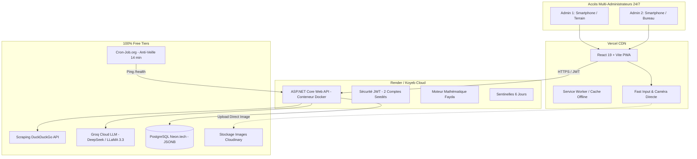

# Plan d'Implémentation : Plateforme "Le Laboratoire" & Maximisation de la Fayda

Développement de la plateforme e-commerce multi-administrateurs **"Le Laboratoire"**, conçue pour tester la rentabilité d'un stock initial (*sel3a*) sur un cycle de 6 jours avec un budget Ads contrôlé, tout en calculant le bénéfice net (*Fayda*) en temps réel et en formulant des recommandations de prix via IA.

## Architecture Globale (0 DA)

---

## Directives Clés & Décisions Validées
- **Accès en Ligne Multi-Gérants** : Les 2 administrateurs accèdent simultanément depuis n'importe où via une URL publique sécurisée.
- **Sécurité Fermée** : Aucun enregistrement public. Deux comptes gérants uniques (`admin1` et `admin2`) injectés directement avec hachage BCrypt.
- **Moteur IA 24/7** : Utilisation de **Groq Cloud API** (DeepSeek-R1 / LLaMA 3.3) sans dépendance d'un PC allumé en local.
- **Scraping Réseaux Sociaux** : Exécution via **DuckDuckGo Search** (sans token, sans limite contraignante, non bloqué par les Captchas).
- **Zéro Perte d'Images** : Upload direct sur Cloudinary (seule l'URL HTTPS finale est persistée dans PostgreSQL).
- **Anti Cold-Start** : Endpoint `/api/health` dédié pour le ping automatique toutes les 14 minutes.

---

## Découpage des Phases de Développement

### Phase 1 : Socle Backend ASP.NET Core & Base PostgreSQL Neon
Mise en place de l'API C#, du modèle de données Entity Framework Core, de l'authentification JWT et du seeder des 2 administrateurs.

#### [NEW] [src/backend/LeLaboratoire.Api/](file:///c:/Users/Administrator/Desktop/eeya/src/backend/LeLaboratoire.Api)
- **`LeLaboratoire.Api.csproj`** : Dépendances `Npgsql.EntityFrameworkCore.PostgreSQL`, `Microsoft.AspNetCore.Authentication.JwtBearer`, `BCrypt.Net-Next`.
- **`Models/`** :
  - `User.cs` : Identifiant, nom d'utilisateur, mot de passe haché, rôle.
  - `Product.cs` : Nom, catégorie, URL d'image Cloudinary, `Specifications` (stockées en `jsonb`), prix d'achat, prix cible.
  - `ProductTest.cs` : Référence produit, `RasLmal`, stock initial, stock restant, budget sponsoring total, ticket de bureau, statut, prix de vente appliqué.
  - `TestDailyMetric.cs` : Jour (1 à 6), date, Ads dépensé, impressions, clics, commandes confirmées, revenu total, Fayda nette.
- **`Data/`** :
  - `AppDbContext.cs` : Configuration EF Core avec mapping `jsonb` et types `decimal(18,2)`.
  - `DbSeeder.cs` : Initialisation automatique des comptes `admin1` et `admin2`.
- **`Services/`** :
  - `FaydaCalculatorService.cs` : Implémentation exacte des équations financières et des 3 sentinelles d'alerte (J3 baisse de prix, J4 hausse de marge, 60% Ads arrêt d'urgence).
  - `JwtTokenService.cs` : Génération et validation des jetons JWT.
  - `MarketResearchService.cs` : Intégration de DuckDuckGo Search et Groq Cloud LLM pour extraction sémantique des prix en DA et arrondi psychologique.
- **`Controllers/`** :
  - `AuthController.cs` : Endpoint de login (`POST /api/auth/login`) et d'identité (`GET /api/auth/me`).
  - `ProductsController.cs` : CRUD des produits avec gestion des spécifications JSON.
  - `TestsController.cs` : Cycle de vie des tests 6 jours, saisie des métriques du jour, recalcul instantané de la Fayda.
  - `HealthController.cs` : Endpoint léger pour le ping anti-veille.
- **`Dockerfile`** : Fichier de build multi-stage optimisé pour déploiement Render/Koyeb.

---

### Phase 2 : Frontend PWA React 19 Mobile-First
Développement de l'interface responsive taillée pour smartphone et bureau avec Bottom Navigation Bar et Fast-Input.

#### [NEW] [src/frontend/](file:///c:/Users/Administrator/Desktop/eeya/src/frontend)
- **`vite.config.js`** : Configuration de `vite-plugin-pwa` avec Service Worker et manifest.
- **`public/manifest.json`** : Configuration PWA (icônes, couleur de thème, affichage standalone plein écran).
- **`src/components/`** :
  - `BottomNav.jsx` : Barre de navigation inférieure fixe (Laboratoire, Produits, Fayda, Profil).
  - `FastDecimalInput.jsx` : Champ de saisie forçant le clavier numérique natif (`inputMode="decimal"`).
  - `CameraCapture.jsx` : Déclencheur direct de la caméra arrière (`capture="environment"`) avec téléversement immédiat vers Cloudinary.
  - `FaydaBadge.jsx` : Indicateur visuel temps réel de la Fayda (vert positif, ambre neutre, rouge négatif).
  - `AlertBanner.jsx` : Affichage clair des sentinelles d'arbitrage (ex: "Baisse de prix recommandée - Jour 3").
- **`src/pages/`** :
  - `Login.jsx` : Page de connexion épurée et sécurisée.
  - `Laboratory.jsx` : Suivi visuel des tests 6 jours avec vue chronologique (J1 à J6) et saisie rapide du soir.
  - `Products.jsx` : Catalogue des marchandises avec spécifications dynamiques (couleurs, tailles).
  - `FaydaDashboard.jsx` : Synthèse financière globale (Total Ras Lmal investi, Total Ads, Fayda cumulée, ROI global).

---

### Phase 3 : Scraping DuckDuckGo & Module IA Groq
Intégration du module d'analyse concurrentielle :
- Requêtes automatisées : `"{Nom du produit}" (DA OR DZD) (site:facebook.com OR site:instagram.com OR site:tiktok.com) Algérie`.
- Extraction des prix par le modèle `llama-3.3-70b-versatile` ou `deepseek-r1-distill-llama-70b` sur Groq.
- Définition du prix plafond du marché et arrondi psychologique (ex: 2 900 DA).

---

## Plan de Vérification & Tests

### Tests Automatisés
- Compilation stricte de l'API .NET : `dotnet build`
- Tests unitaires du moteur financier : validation des équations de calcul :
  - Test 1 : Achat 8 pièces à 1 000 DA (Ras Lmal = 8 000 DA) + Ads 2 000 DA + 6 ventes à 2 500 DA (Ticket = 15 DA). Vérification : Dépense = 10 090 DA, Revenu = 15 000 DA, Fayda = +4 910 DA.
  - Test 2 : Déclenchement de l'alerte Arrêt d'Urgence dès que Ads consommé $\ge$ 1 200 DA sans aucune commande.

### Vérification Manuelle & Utilisateur
1. **Test d'Authentification** : Connexion avec `admin1` et `admin2`, validation de l'impossibilité de créer un compte anonyme.
2. **Test Mobile Fast-Input** : Vérification sur smartphone que le clic sur le champ de dépense Ads affiche le pavé numérique sans bascule de clavier.
3. **Test Caméra** : Prise de vue photo depuis smartphone et persistance de l'URL Cloudinary.
4. **Vérification Multi-Gérants** : Ajout d'une métrique par le compte 1, visualisation instantanée par le compte 2.
